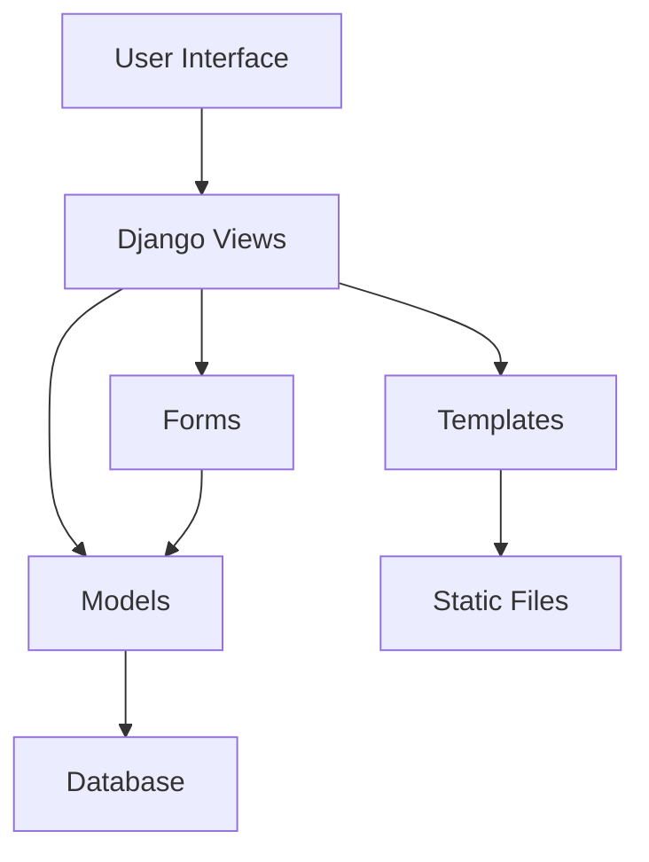

# Planmate Application Architecture

## System Overview

## Component Details

### 1. Models Layer

The data layer consists of four main models:

1. **Subject Model**
   - Stores information about academic subjects
   - Fields: code, name, description, credits, semester

2. **Event Model**
   - Represents scheduled classes, exams, and labs
   - Fields: subject, event_type, start_time, end_time, location, notes, repeat_weekly

3. **Student Model**
   - Extends Django User model for student users
   - Fields: user, student_id, enrolled_subjects

4. **Teacher Model**
   - Extends Django User model for teacher users
   - Fields: user, teacher_id, managed_subjects

### 2. Views Layer

The views handle the application logic:

1. **Authentication Views**
   - Registration, login, logout

2. **Dashboard Views**
   - User dashboard with overview information

3. **Subject Management Views**
   - List, detail, create, update, delete subjects

4. **Event Management Views**
   - Calendar view, event CRUD operations

5. **API Views**
   - JSON endpoints for calendar data

### 3. Templates Layer

The presentation layer uses Django templates:

1. **Base Templates**
   - Base layout with navigation
   - Common styling and scripts

2. **Authentication Templates**
   - Login and registration forms

3. **Dashboard Templates**
   - User overview and quick actions

4. **Subject Templates**
   - Subject listing and detail views

5. **Calendar Templates**
   - Interactive calendar interface

### 4. Forms Layer

Custom forms for data validation:

1. **SubjectForm**
   - Validation for subject data

2. **EventForm**
   - Validation for event data with time conflict checking

### 5. Static Files

Frontend assets:

1. **CSS**
   - Bootstrap 5
   - Custom styling

2. **JavaScript**
   - FullCalendar.js for calendar functionality
   - jQuery for DOM manipulation

3. **Images/Assets**
   - Icons and other media

## Data Flow

1. **User Request**
   - User interacts with the UI (clicks, form submissions)

2. **URL Routing**
   - Django routes request to appropriate view

3. **View Processing**
   - View processes request, interacts with models

4. **Model Operations**
   - Models handle database operations

5. **Template Rendering**
   - Views render templates with context data

6. **Response**
   - HTML/JSON response sent to user

## Security Features

1. **Authentication**
   - Django's built-in authentication system
   - User roles (student, teacher)

2. **Authorization**
   - Role-based access control
   - Permission checks in views

3. **Data Validation**
   - Form validation
   - Model field constraints

## Future Scalability

1. **Database**
   - Currently using SQLite, easily switchable to PostgreSQL/MySQL

2. **Caching**
   - Can implement Redis/Memcached for performance

3. **API**
   - RESTful API can be added for mobile apps

4. **Microservices**
   - Components can be separated into microservices